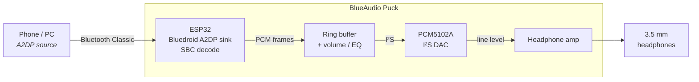
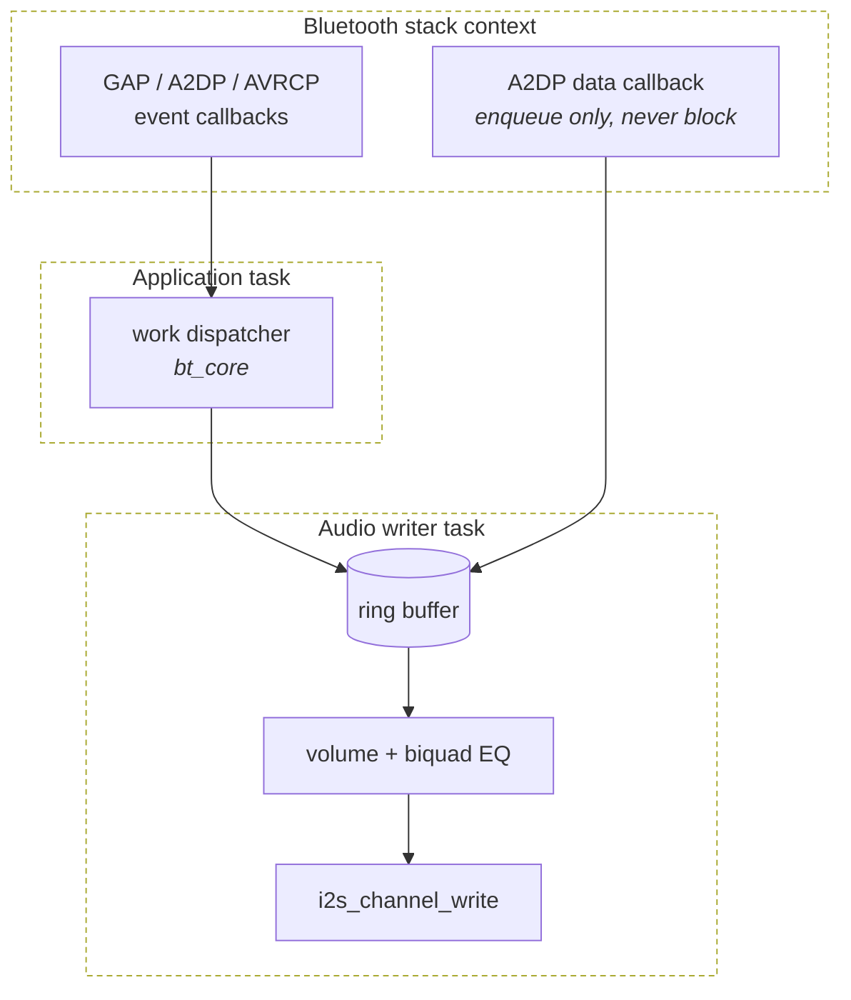

# BlueAudio Puck

A pocket-sized **Bluetooth audio receiver**: it pairs with a phone or computer as
an A2DP sink, decodes the stream on an ESP32, and pushes the PCM out over I²S to
an external DAC and headphone amplifier feeding a 3.5 mm jack. Wired headphones,
wirelessly.

> **Target silicon: the original ESP32 only.**
> A2DP rides on Bluetooth Classic (BR/EDR), which Espressif removed from the
> ESP32-S3 and ESP32-C3. Those parts are BLE-only and cannot run this firmware.

## Signal chain



## Firmware architecture



Everything expensive happens in the audio writer task. The A2DP data callback runs
in Bluetooth stack context and does nothing but hand bytes to the ring buffer —
doing DSP there starves the stack and causes dropouts.

## Hardware

Planned wiring for the prototype. **Not yet verified against real hardware** — the
DAC is not connected as of this writing.

| ESP32   | PCM5102A | Signal                |
| ------- | -------- | --------------------- |
| GPIO 26 | BCK      | Bit clock             |
| GPIO 25 | LRCK     | Word select (L/R)     |
| GPIO 22 | DIN      | Serial data           |
| 3V3     | VIN      | Power                 |
| GND     | GND      | Ground                |

PCM5102A breakout jumpers:

| Pin  | Tie to | Why                                              |
| ---- | ------ | ------------------------------------------------ |
| SCK  | GND    | Use the internal PLL; floating SCK gives silence  |
| XSMT | 3V3    | Release soft-mute; low means muted                |
| FMT  | GND    | I²S (Philips) frame format                        |
| FLT  | GND    | Normal latency filter                             |
| DEMP | GND    | De-emphasis off                                   |

Pins are configurable — see `idf.py menuconfig` → *BlueAudio Puck*.

## Building

The project targets **ESP-IDF v5.5.4**.

```powershell
& 'C:\Espressif\tools\Microsoft.v5.5.4.PowerShell_profile.ps1'
idf.py set-target esp32
idf.py build
idf.py -p COM10 flash monitor
```

`sdkconfig` is generated and gitignored; `sdkconfig.defaults` is the source of truth.

## Roadmap


## Prior art

This firmware is written from scratch against the IDF v5.5 API, but the following
projects informed its design and are worth reading:

- [WillyBilly06/ESP32-A2DP-SINK-WITH-CODECS-UPDATED](https://github.com/WillyBilly06/ESP32-A2DP-SINK-WITH-CODECS-UPDATED) — LDAC/aptX/AAC patched into the IDF stack
- [YetAnotherElectronicsChannel/ESP32_4CH_DSP_BT_AMPLIFIER](https://github.com/YetAnotherElectronicsChannel/ESP32_4CH_DSP_BT_AMPLIFIER) — parametric EQ with a Wi-Fi config UI
- [ESP32 as BT receiver with DSP capabilities](https://hackaday.io/project/166122-esp32-as-bt-receiver-with-dsp-capabilities) — biquads in the a2dp_sink render path
- [gangg111/ESP32-Bluetooth-Audio-Receiver](https://github.com/gangg111/ESP32-Bluetooth-Audio-Receiver) — PCM5102A + OLED metadata display
- [pschatzmann/ESP32-A2DP](https://github.com/pschatzmann/ESP32-A2DP) — the reference Arduino-side A2DP library

## Licence

MIT — see [LICENSE](LICENSE).
