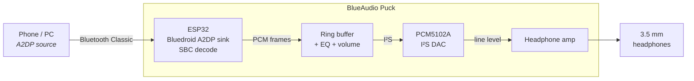
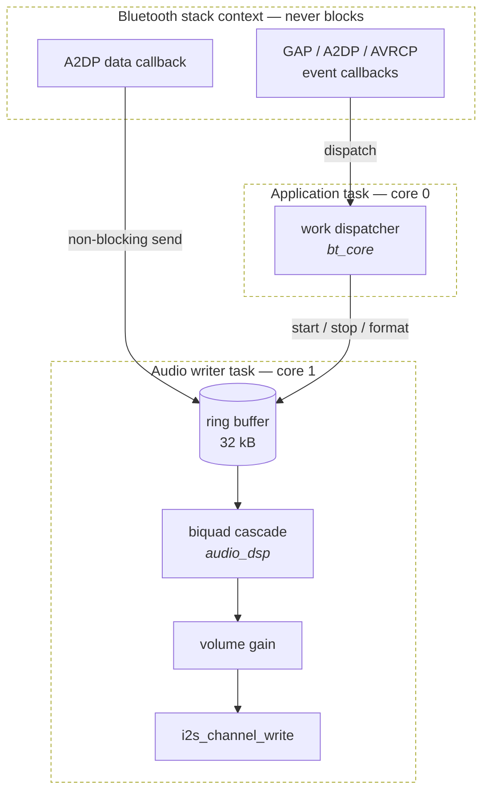

# BlueAudio Puck

**Turn wired headphones wireless.** A pocket-sized Bluetooth audio receiver: it
pairs with a phone or computer as an A2DP sink, decodes the stream on an ESP32,
runs it through a parametric equaliser, and pushes PCM out over I²S to an
external DAC and headphone amplifier feeding a 3.5 mm jack.

[](https://github.com/Zektopic/esp32-blue-audio-puck/actions/workflows/build.yml)

-informational)


> [!IMPORTANT]
> **Original ESP32 only.** A2DP rides on Bluetooth Classic (BR/EDR), which
> Espressif removed from the ESP32-S3 and ESP32-C3. Those parts are BLE-only and
> cannot run this firmware — and they cannot fall back to LE Audio either, since
> that needs BLE 5.2 isochronous channels and they are 5.0.

---

## What it does

| | |
| --- | --- |
| **A2DP sink** | Pairs as a headphone. SBC decode, 16/32/44.1/48 kHz, mono or stereo. |
| **I²S output** | 16-bit PCM to an external DAC. APLL-clocked for accurate 44.1 kHz. |
| **AVRCP, both roles** | Phone's volume slider works; track metadata comes back; buttons drive transport. |
| **Parametric EQ** | Five biquad bands per channel, sample-rate aware, ~16% of one core when fully active. |
| **Physical UI** | One multi-function button, optional volume keys, PWM status LED. |
| **Power policy** | Capped TX power, 80–160 MHz frequency scaling, deep sleep on idle. |
| **Bounded pairing** | Discoverable only when you ask for it, not permanently. |

## Signal chain



## Firmware architecture

The single rule everything else follows: **Bluedroid callbacks only enqueue.**
Anything slow in stack context stalls the radio and comes out as dropouts.



Every cost — the blocking I²S write, the EQ, the gain — lives on the writer
task, pinned to the core the radio is not using.

### Components

| Component | Responsibility |
| --- | --- |
| [`bt_core`](components/bt_core/) | Stack bring-up, work queue between Bluedroid and the app task, bond management |
| [`audio_sink`](components/audio_sink/) | I²S channel, ring buffer, writer task, volume gain |
| [`audio_dsp`](components/audio_dsp/) | Parametric biquad equaliser and its benchmark |
| [`puck_avrcp`](components/puck_avrcp/) | AVRCP controller and target: volume, metadata, transport keys |
| [`puck_ui`](components/puck_ui/) | Button gestures and PWM status LED |
| [`puck_power`](components/puck_power/) | TX power, frequency scaling, idle deep sleep |

These are written from scratch against the IDF v5.5 API rather than reusing the
ESP-IDF example's shared components, which are pulled in by `${IDF_PATH}` path
and would make the repository unbuildable anywhere else. See
[docs/design-notes.md](docs/design-notes.md) for what that surfaced.

## Hardware

> [!WARNING]
> **The wiring below is planned, not verified.** No DAC has been connected to
> the prototype yet. Treat the pin map as a proposal to check, not as as-built.

| ESP32 | PCM5102A | Signal |
| --- | --- | --- |
| GPIO 26 | BCK | Bit clock |
| GPIO 25 | LRCK | Word select (L/R) |
| GPIO 22 | DIN | Serial data |
| 3V3 | VIN | Power |
| GND | GND | Ground |
| GPIO 33 | — | Main button, to GND (also an RTC pin, so it wakes from deep sleep) |
| GPIO 2 | — | Status LED (on-board on most devkits) |

PCM5102A breakout jumpers — these cause most "no sound" reports:

| Pin | Tie to | Why |
| --- | --- | --- |
| SCK | GND | Use the internal PLL. Left floating you get silence. |
| XSMT | 3V3 | Release soft-mute. Low means muted. |
| FMT | GND | I²S (Philips) frame format, which is what the firmware defaults to |
| FLT | GND | Normal latency filter |
| DEMP | GND | De-emphasis off |

Full parts discussion, power budget and the roadmap to a custom board:
[docs/hardware.md](docs/hardware.md).

## Building

Requires **ESP-IDF v5.5.4**.

```powershell
& 'C:\Espressif\tools\Microsoft.v5.5.4.PowerShell_profile.ps1'
idf.py set-target esp32
idf.py build
idf.py -p COM10 flash monitor
```

`sdkconfig` is generated and gitignored; `sdkconfig.defaults` is the source of
truth. Project settings live under **BlueAudio Puck** in `idf.py menuconfig`.

Expected first output:

```
I (593) puck: BlueAudio Puck booting (IDF v5.5.4)
I (603) audio_sink: ready: bck=26 ws=25 dout=22, 32 kB buffer, prefetch 25%
I (603) audio_dsp: 5-band equaliser ready at 44100 Hz (off, 0 active)
I (1313) bt_core: controller up, address 6c:c8:40:56:ea:da
I (1373) puck: no bonded sources; discoverable as "BlueAudio Puck"
```

## Using it

| Gesture | Action |
| --- | --- |
| Single press | Play / pause |
| Double press | Next track |
| Triple press | Previous track |
| Hold 1.5 s | Open a pairing window (120 s) |
| Hold 5 s | Forget every bonded source, then reopen pairing |

| LED | Meaning |
| --- | --- |
| Fast blink | Discoverable, waiting for a source |
| Slow breathe | Connected, not streaming |
| Steady dim | Audio playing |
| Triple flash | Something failed to start |

Volume normally comes from the phone over AVRCP absolute volume. Dedicated
volume buttons are optional and unfitted by default.

## Configuration

All under `idf.py menuconfig` → **BlueAudio Puck**. Every GPIO accepts `-1` for
"not fitted".

| Option | Default | Notes |
| --- | --- | --- |
| `PUCK_BT_DEVICE_NAME` | `BlueAudio Puck` | Shown in the pairing list |
| `PUCK_I2S_BCK/LRCK/DOUT_GPIO` | 26 / 25 / 22 | |
| `PUCK_I2S_SLOT_FORMAT` | Philips | Must match the DAC's `FMT` pin |
| `PUCK_I2S_USE_APLL` | on | Accurate 44.1 kHz, slightly more current |
| `PUCK_AUDIO_RINGBUF_KB` | 32 | Larger rides out radio retries, costs RAM and latency |
| `PUCK_AUDIO_PREFETCH_PERCENT` | 25 | ≈46 ms cushion; also what an underrun costs to rebuild |
| `PUCK_AUDIO_WRITER_CORE` | 1 | Keep off core 0, which runs the radio |
| `PUCK_EQ_BANDS` | 5 | A ceiling, not a fixed price — flat bands cost nothing |
| `PUCK_EQ_ENABLED_AT_BOOT` | off | Starts transparent |
| `PUCK_EQ_BENCHMARK_AT_BOOT` | off | Times the cascade; see below |
| `PUCK_PAIRING_WINDOW_SECONDS` | 120 | How long a long press stays discoverable |
| `PUCK_BT_TX_POWER_LEVEL` | 4 (0 dBm) | Raise for range, lower for runtime |
| `PUCK_CPU_MAX/MIN_FREQ_MHZ` | 160 / 80 | Dynamic frequency scaling |
| `PUCK_IDLE_SLEEP_MINUTES` | 15 | Counts only while disconnected; 0 disables |

## Measured

| What | Result |
| --- | --- |
| EQ cost, 5 stereo biquad sections | 1337 µs per 360-frame block = **16% of one core** at 160 MHz |
| EQ cost per band | ~3.2% of a core, so roughly 30 sections before saturating one |
| Firmware image | ~1.0 MB (needs the large single-app partition; the 1 MB default does not fit) |
| Free heap after boot | ~210 kB |
| Pairing window | Closes at 120.0 s, verified on hardware |

Power draw has **not** been measured. The estimates in
[docs/hardware.md](docs/hardware.md) are datasheet-derived, and devkit
measurements would be meaningless anyway — the USB-UART bridge and the AMS1117
regulator dominate a devkit's draw whatever the firmware does.

## Documentation

- [docs/hardware.md](docs/hardware.md) — parts, wiring, power budget, board roadmap
- [docs/design-notes.md](docs/design-notes.md) — why the firmware is shaped this way, and the IDF bugs it avoids
- [docs/troubleshooting.md](docs/troubleshooting.md) — no sound, no pairing, dropouts, build failures
- [SECURITY.md](SECURITY.md) — threat model, pairing decisions, accepted risks

## Status

Working: builds, boots, pairs, advertises correctly, AVRCP negotiates, power and
UI subsystems initialise. Verified on an ESP32-WROOM devkit.

**Not yet verified:** audio actually coming out. No DAC has been connected. The
I²S configuration, the EQ response and the end-to-end audio path are reasoned
against the ESP-IDF v5.5.4 driver sources, not heard.

## Prior art

Written from scratch, but these informed the design and are worth reading:

- [WillyBilly06/ESP32-A2DP-SINK-WITH-CODECS-UPDATED](https://github.com/WillyBilly06/ESP32-A2DP-SINK-WITH-CODECS-UPDATED) — LDAC/aptX/AAC patched into the IDF stack, which proves the SBC ceiling is firmware and not silicon
- [YetAnotherElectronicsChannel/ESP32_4CH_DSP_BT_AMPLIFIER](https://github.com/YetAnotherElectronicsChannel/ESP32_4CH_DSP_BT_AMPLIFIER) — parametric EQ with a Wi-Fi config UI, full schematics and gerbers
- [ESP32 as BT receiver with DSP capabilities](https://hackaday.io/project/166122-esp32-as-bt-receiver-with-dsp-capabilities) — biquads in the a2dp_sink render path; left the biquad budget as an open question, which [docs/design-notes.md](docs/design-notes.md) answers
- [gangg111/ESP32-Bluetooth-Audio-Receiver](https://github.com/gangg111/ESP32-Bluetooth-Audio-Receiver) — PCM5102A plus an OLED showing track metadata
- [pschatzmann/ESP32-A2DP](https://github.com/pschatzmann/ESP32-A2DP) — the reference Arduino-side A2DP library

## Licence

MIT — see [LICENSE](LICENSE).
