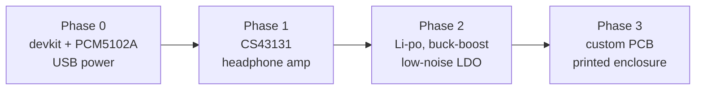

# Hardware

Parts, wiring, power budget and the route from a breadboard to a puck.

> [!NOTE]
> The pin map below is **as wired**. The I²C bus and OLED address are confirmed
> by a scan on the real board. Everything about audio and power is still
> unverified: no DAC has produced sound yet, no cell is fitted, and the power
> figures are datasheet-derived estimates rather than measurements.

## Why the original ESP32

A2DP rides on Bluetooth Classic (BR/EDR). Espressif removed Classic from every
chip after the original ESP32, so:

| Part | Bluetooth | A2DP sink? |
| --- | --- | --- |
| ESP32 (Xtensa) | Classic BR/EDR + BLE | **Yes** |
| ESP32-S3 | BLE 5.0 only | No |
| ESP32-C3 | BLE 5.0 only | No |

The S3 and C3 cannot fall back to LE Audio either — that needs BLE 5.2
isochronous channels and they are 5.0. This is silicon, not firmware.

Use a **WROOM-32U with an external antenna** if you can. A puck lives in a
pocket or bag with a body between it and the phone, and builders consistently
report better range with an external antenna than with the PCB one.

## The pin map, and why these pins

The layout lets a PCM5102A board sit **directly beneath** an ESP32 devkit,
joined by short solder bridges, instead of using whichever pins are convenient
on a breadboard. That is what makes it a puck rather than a project box.

| ESP32 | Signal | Goes to |
| --- | --- | --- |
| GPIO 4 | I²S BCK | PCM5102A `BCK` |
| GPIO 15 | I²S LRCK | PCM5102A `LRCK` |
| GPIO 2 | I²S DATA | PCM5102A `DIN` |
| GPIO 21 | I²C SDA | SSD1306 `SDA` |
| GPIO 22 | I²C SCL | SSD1306 `SCL` |
| GPIO 33 | Button | to GND |
| GPIO 35 | Battery sense | divider midpoint (optional) |
| 3V3, GND | Power | both boards |

Three things about these pins are worth knowing before you solder.

**No MCLK wire.** Solder the `SCK` bridge on the front of the PCM5102A and it
derives its own clock from BCK. The ESP32 pin that would otherwise carry MCLK
is left unconnected — put tape over it so it cannot short to the DAC board
sitting on top.

**GPIO 2 is doing double duty.** It is the devkit's on-board LED pin, so that
LED now flickers with audio data. Harmless, and the reason `PUCK_LED_GPIO`
defaults to *not fitted*: an external status LED needs a free pin such as 27,
and with the OLED fitted it is largely redundant anyway.

**GPIO 2 and GPIO 15 are strapping pins.** Only during reset — driving them as
outputs afterwards is fine, which is what makes this layout work at all. The
practical consequence is that a DAC loading GPIO 2 can stop the board entering
download mode, so hold **BOOT** while flashing if `idf.py flash` reports
`Wrong boot mode detected (0x13)`.

### PCM5102A jumpers

These cause most of the "no sound" reports on these boards.

| Pin | Set to | Why |
| --- | --- | --- |
| SCK bridge | **soldered** | Runs the internal PLL, so no MCLK wire is needed |
| XSMT | 3V3 | Releases soft-mute. Low means muted. |
| FMT | GND | I²S (Philips) format — matches the firmware default |
| FLT | GND | Normal latency filter |
| DEMP | GND | De-emphasis off |

### The OLED

A 0.96" 128x64 SSD1306 on the I²C bus. Confirmed on this hardware:

```
I (606) i2cprobe:   ACK at 0x3c
I (616) i2cprobe: scan done, 1 device(s)
```

Modules ship strapped to **0x3C or 0x3D** depending on a solder jumper, so the
address is a Kconfig option. The driver probes before configuring anything and
says plainly when nothing answers, rather than producing a cascade of timeouts.

Most breakouts fit their own 4.7 kΩ pull-ups. The firmware also enables the
ESP32's internal pull-ups, which are weak (~45 kΩ) but adequate for a short
run at 400 kHz. A long or unreliable bus wants real resistors.

A full frame is 1025 bytes; at 400 kHz that is about 21 ms, which is why the
refresh task runs at a few hertz rather than at video rates.

The screen needs no extra hardware for the signal meter — link quality comes
from the Bluetooth controller, not from a sensor.

### Battery sensing

Optional and unfitted by default. A divider from the cell to an ADC1 pin:

- **Two 100 kΩ resistors** give 2:1 — a full 4.2 V cell reads 2.1 V at the pin,
  comfortably inside the ADC's ~3.1 V full scale at 11 dB attenuation, and the
  pair draws about 21 µA.
- **GPIO 35** is a good input: input-only, so it cannot be driven by mistake,
  and it is ADC1. ADC2 is shared with the Wi-Fi radio and is refused.
- Set `PUCK_BATTERY_DIVIDER_RATIO_X100` to match the resistors you actually
  fitted. A percentage from the wrong ratio is worse than no percentage.

A voltage-derived percentage is an estimate, not a fuel gauge — see
[design-notes.md](design-notes.md#battery-percentage-is-an-estimate).

If your breakout ties `FMT` high instead, switch the firmware to left-justified
under **BlueAudio Puck → audio output → I²S frame format**. A format mismatch
produces audio that is present but wrong, which is far harder to diagnose than
silence.

### Expectation setting

The PCM5102A is a **line-level output, not a headphone driver**. It will be
audible on 32 Ω headphones but quiet. That is fine for proving the chain; a real
headphone amplifier is the next phase, not this one.

## Phase 1 — proper analogue path

| Function | Part | Notes |
| --- | --- | --- |
| DAC + headphone amp | **CS43131** | One package, low power, drives 32 Ω comfortably. What commercial dongles use. |
| Alternative DAC | PCM5102A | Line level only |
| Alternative amp | TPA6132A2 | Pairs with the PCM5102A; more parts, easier to hand-solder |

## Phase 2 — power

| Function | Part | Notes |
| --- | --- | --- |
| Cell | 500–1000 mAh Li-po | Size decides runtime and therefore enclosure dimensions |
| Charger | BQ25180 | I²C status; MCP73831 if you want simple |
| Main rail | TPS63020 buck-boost | ~88–90% across the cell's range, and keeps working down to 3.0 V |
| DAC analogue rail | TPS7A20 LDO | Low noise, fed from the switcher's output |

**Do not run the DAC's analogue supply from the switcher directly.** Audio DACs
are unforgiving of noisy rails and you will hear it as hiss. Two-stage —
buck-boost to ~3.5 V for the ESP32, then a low-noise LDO down to 3.3 V for the
DAC's analogue pin only — costs almost nothing at a 25 mA load.

An LDO straight from the cell would be simpler, but its efficiency is
V_out ÷ V_in: 79% at a full 4.2 V cell, and it drops out around 3.4 V, stranding
the bottom of the cell's capacity. The buck-boost is worth roughly 20–25% more
runtime for one part.

## Power budget

> **Estimates only.** Datasheet figures and typical reported values. Nothing
> here has been measured on this build, and measuring on a devkit would not
> help — the CP210x bridge and the AMS1117 regulator dominate a devkit's draw
> whatever the firmware does.

At the 3.3 V rail while streaming:

| Component | Draw |
| --- | --- |
| ESP32 @ 160 MHz, BT Classic active | ~110 mA |
| PCM5102A | ~25 mA |
| Headphone amp (TPA6132A2 class) | ~10 mA |
| Status LED (averaged) | ~1 mA |
| **Total** | **~146 mA (≈482 mW)** |

The ESP32 is roughly three quarters of the budget. Every optimisation that is
not about the ESP32 is rearranging deck chairs.

By state:

| State | Draw | What is running |
| --- | --- | --- |
| Playing | ~146 mA | Everything |
| Connected, paused | ~65 mA | Link in a low-power mode, DAC muted |
| Deep sleep | ~10 µA | Custom board only |

Estimated runtime through an ~88% converter (≈148 mA from a 3.7 V nominal cell):

| Cell | Runtime |
| --- | --- |
| 500 mAh | ~3 h |
| 1000 mAh | ~6 h |
| 2000 mAh | ~12 h |

### Levers, ranked by what they actually buy

1. **A bigger cell.** Unglamorous, and by far the biggest lever. A 1000 mAh
   pouch is a couple of millimetres thicker and doubles runtime. Do this before
   any firmware cleverness.
2. **Buck-boost instead of an LDO.** ~20–25%.
3. **160 MHz instead of 240.** ~15%. Already the default here.
4. **Lower Bluetooth TX power.** Already capped at 0 dBm
   (`PUCK_BT_TX_POWER_LEVEL`); worth several mA.
5. **Deep sleep on disconnect.** Extends playback by nothing, but it is the
   difference between flat by morning and fine next week. Already implemented.
6. **Power-gate the headphone amp** using the 3.5 mm jack's switched contact and
   a load switch. Free hardware you already have in the connector.

### The honest comparison

A Qudelix 5K runs ~20 hours; a FiiO BTR7 ~9. They use purpose-built Bluetooth
audio SoCs that idle in single-digit milliamps with hardware codec engines. This
is a general-purpose MCU running a full software Bluetooth stack, and no amount
of tuning closes that gap.

That is the trade for firmware you control. Size the cell accordingly rather
than trying to optimise your way to parity.

## Codecs

Stock ESP-IDF is **SBC only**, which is the usual argument for eventually
replacing the ESP32 with a dedicated part like a Microchip BM83.

That argument is weaker than it looks. The
[ESP32-A2DP-SINK-WITH-CODECS-UPDATED](https://github.com/WillyBilly06/ESP32-A2DP-SINK-WITH-CODECS-UPDATED)
project patches LDAC, aptX, aptX-HD and AAC into the IDF Bluetooth stack. The
codec ceiling is a firmware limit, not a silicon one — worth establishing before
planning a board respin around a different SoC.

## Roadmap



Nothing in the firmware is wasted if the brain changes later: the DAC, power,
enclosure and UI work all carry over, and only `bt_core` and `puck_avrcp` are
Bluetooth-specific.
